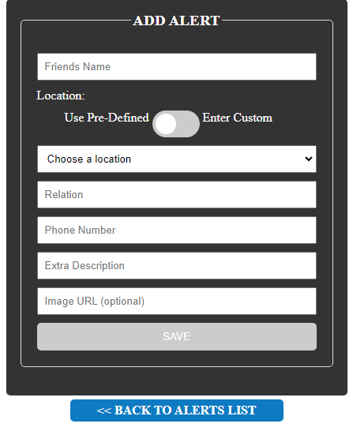
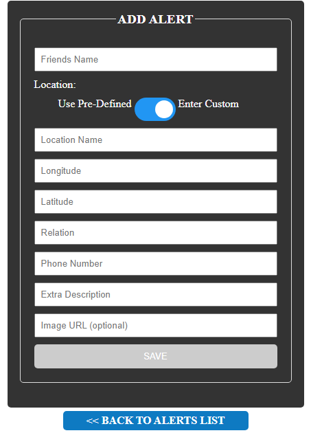
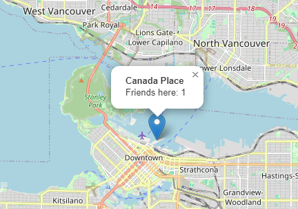

# Angular Address Tracker Web App

This super creepy Angular web app project is an Address Tracker you can use to keep track of the locations of your friends. This app was repurposed from a moch app that would allow superheroes to keep track of supervillains, but I remade it to be something you can use in real life, albeit very weird. The app utilizes a Leaflet module map to display the locations of your list of friends. The list is normally held in a database but will save these results as the API key has been removed. Each friend held in the list has a profile with additional information entered by the user. The locations of these users are tracked through coordinates and can only exist within the lower mainland of BC.

## Features

- **Interactive Map:** The project includes an interactive leaflet map, which displays markers corresponding to locations saved in the database. Markers contain an overlapping feature, which allows you to view multiple people at the same location.

- **Coordinate Conversion:** Users can add a new location to the database by entering in the coordinates. The location is then converted into a marker on the leaflet map.

## How does it work?

When launching the application, users will arrive at a home screen displaying the maps on the upper half, and the primary interface on the bottom enabled by routing. The list of friends can be ordered by the columns of the display and friends can also be removed by admin privileges (in this case, knowing the password which is ""). When adding a new friend, users will be taken to an input form as such:

<p align="center">
  
</p>

If the location you want to add int already in the public list, you can add your own location by switching to "Custom Location", which uses REGEX and form componenets to ensure your inputs work:

<p align="center">
  
</p>

The overlapping feature will show if multiple firends happen to be located at the same desitination, which will be updated dynamically as firends are added or removed:

<p align="center">
  
</p>

## Installation and Use

Follow these steps to set up and run the Address Tracker locally:

1. Clone the repository to your local machine:

   ```bash
   git clone https://github.com/Daksh2060/address-tracker-app-angular
   ```
   
2. Run node packet manager in the project directory to download modules:

   ```bash
   npm install
   ```

3. Launch local server to run:

   ```bash
   ng serve -o
   ```
   
## Contact

Feel free to reach out if you have any questions, suggestions, or feedback:

- **Email:** dpa45@sfu.ca
- **LinkedIn:** [@Daksh Patel](https://www.linkedin.com/in/daksh-patel-956622290/)
